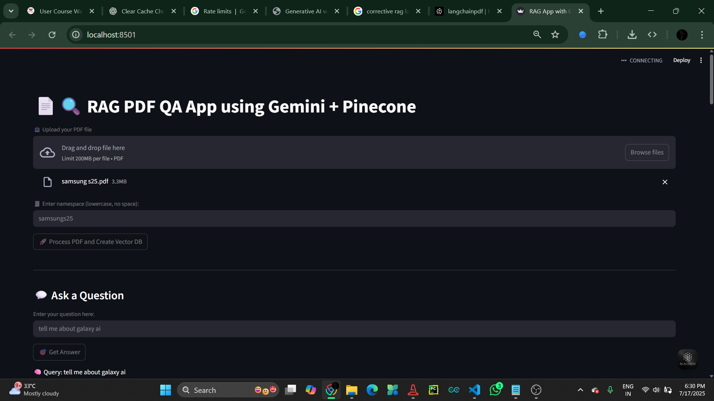

# 🤖 RAG PDF Chatbot (Gemini + Pinecone + LangChain)

This is a Streamlit web app that allows users to upload a PDF document and ask questions about its content. It uses **LangChain**, **Google Gemini Embeddings**, and **Pinecone Vector DB** to build a powerful RAG (Retrieval-Augmented Generation) pipeline.

---

## 🚀 Features

- 📄 Upload any PDF document
- 🔍 Split content using `RecursiveCharacterTextSplitter`
- 🧠 Generate embeddings using **Gemini Embedding (`embedding-001`)**
- 📦 Store vectors in **Pinecone**
- 🎯 Ask natural language questions about your PDF
- 🔁 Corrective RAG: fallback to better answers using retrieved documents
- ✅ View both final answer and source document content

---

## 📸 App Preview



> *(Screenshots placed in `/images` folder – update with your own)*

---

## 🧰 Tech Stack

- [Streamlit](https://streamlit.io/)
- [LangChain](https://python.langchain.com/)
- [Gemini Embedding API](https://ai.google.dev/)
- [Pinecone Vector Database](https://www.pinecone.io/)
- [PDF Parsing](https://python.langchain.com/docs/modules/data_connection/document_loaders/pdf)

---

## 🧪 How It Works

1. 📤 Upload a PDF
2. ✂️ Split into text chunks
3. 🧠 Embed chunks using Gemini Embeddings
4. 🗃️ Store in Pinecone (with `namespace`)
5. ❓ Ask a question
6. 🤖 LLM tries to answer directly
7. 🛟 If confidence is low → fallback to RAG
8. 📚 RAG returns answer with source references

---

## 🔐 Streamlit Secrets Configuration

Store API keys safely in `.streamlit/secrets.toml`:

```toml
GOOGLE_API_KEY = "your-gemini-api-key"
PINECONE_API_KEY = "your-pinecone-api-key"
PINECONE_ENV = "your-pinecone-env"
PINECONE_INDEX = "langchainpdf"
PINECONE_NAMESPACE = "llmpdf"
